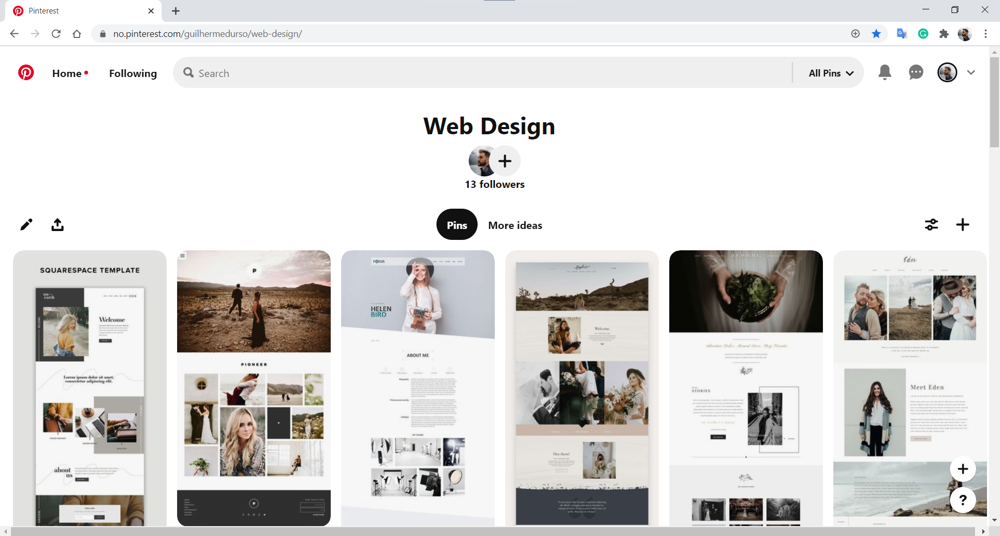
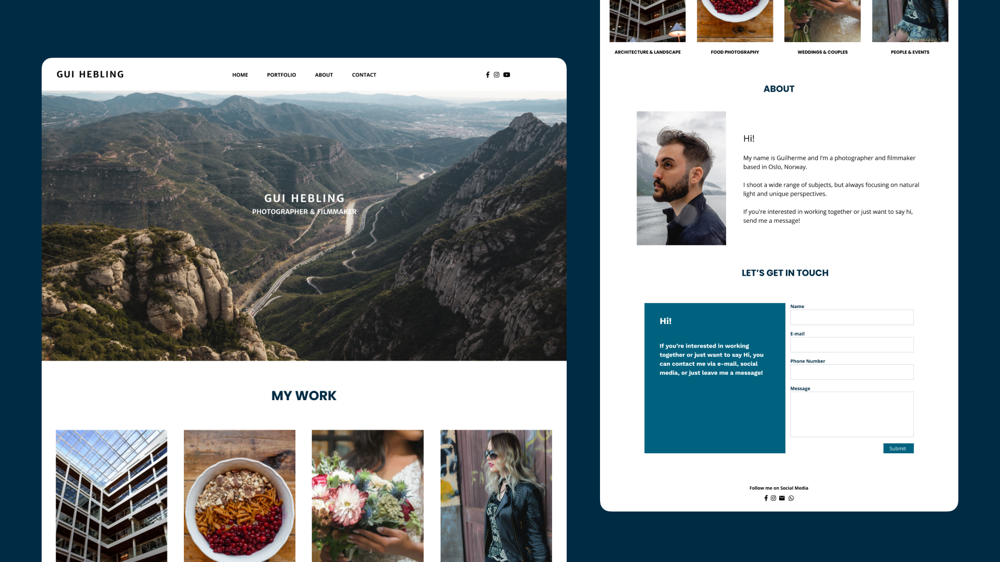

# Photographer Portfolio

## The project
This website was created with the intention of putting into practice some Web Development concepts.  
I used my freelance work as photographer and filmmaker as an actual real world example.
  

### Deployed website
You can find the deployed website at: https://gdhebling.github.io/photographer-portfolio/

## The steps
### Research
I started the project researching and looking for inspirations utilizing websites such as Pinterest and Dribbble.
  

### Concept
Then, with those inspirations in mind, a mockup was made using Figma.
  

### Coding
The coding was made from ground-up with no tutorials, as a way to force me into remembering and finding the best alternatives to the issues I might encounter. Some design changes were made as the project was taking shape. 
p.s.: An extensive use of Google was made during the project! 😂

### Technologies and tools used
HTML5, CSS3, SCSS/Sass, JavaScript, and Figma. 

### Next steps
**Form:**
I'm currently using Formspree as a way to collect submissions from the Contact Form. 
Next step will be to learn PHP to implement it on the website.

**Responsiveness:**
The Navbar is still lacking a better responsiveness. 
One idea is to implement a burger menu on it.

[website]: [https://gdhebling.github.io/photographer-portfolio/]