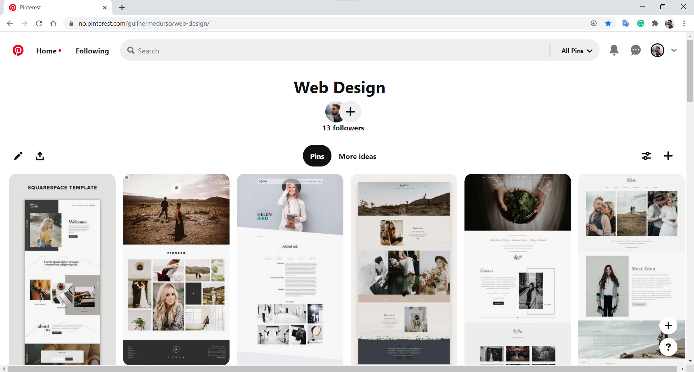

# Photographer Portfolio

## The project
Website created to put into practice some Web Development concepts.  
I used my freelance work as a photographer and filmmaker as an actual real-world example.
  

### Deployed website
You can find the deployed website at https://gdhebling.github.io/photographer-portfolio/

## The steps
### Research
I started the project researching and looking for inspirations utilizing websites such as Pinterest and Dribbble.
  

### Concept
Then, with those inspirations in mind, a mockup was made using Figma.
  

### Coding
The coding was made from ground-up with no tutorials, as a way to force me into remembering and finding the best alternatives to the issues I might encounter. The design went through some changes as the project was taking shape.  
p.s.: With extensive use of Google made during the project! 😂

## Technologies and tools used
HTML5, CSS3, SCSS/Sass, JavaScript, and Figma.  

    &nbsp;&nbsp;
    &nbsp;&nbsp;
    &nbsp;&nbsp;
    &nbsp;&nbsp;
    &nbsp;&nbsp;
    &nbsp;&nbsp;
    

## Next steps
**Form:**
I'm currently using Formspree as a way to collect submissions from the Contact Form.  
A step will be to learn PHP to implement it on the website.

**Responsiveness:**
The Navbar is still lacking better responsiveness.  
One idea is to implement a burger menu on it.

**Performance:**
✔ Study about website optimization and performance to reduce loading time.  
➡ Website images downsized to optimize load time. **Result**: **Google Lighthouse's Audit Score** went from 65 to 75.

## That's it!
Thanks for reading! 😀  
I'm Guilherme. Front-End Web Developer.  

You can find me on:  
    

    &nbsp;&nbsp;

[website]: [https://gdhebling.github.io/photographer-portfolio/]
